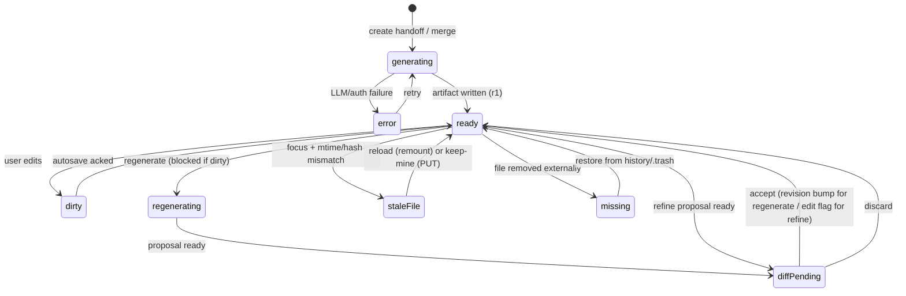
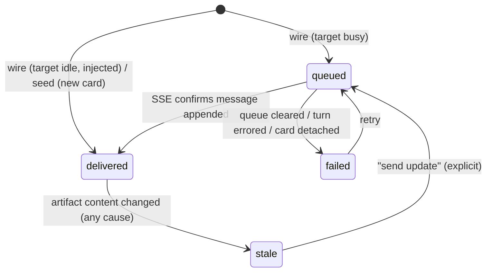

# Handoff & Merge: cross-card knowledge transfer for melon

Proposal / design doc. Status: **Implemented — phases 1–4** (handoff
generate/edit/seed, inject into existing cards, content-staleness + send
update, regenerate with diff + revisions/history, AI refine, merge with
conflicts, artifact browser, restore). Generation runs as a live job: the
artifact file (slug of the chosen name) is created the moment the user names
it, and statuses + the streamed body land on the visible card via SSE until
done. Provider + model are picked together in one dialog (defaulting to the
source card's model). Verified with unit tests + live endpoint smoke tests.
Remaining gaps are listed at the end of §18.

Two features on the melon canvas:

1. **Handoff** — distill what a card's session established into a durable
   markdown artifact, see and edit it on the canvas, then start a new session
   from it or inject it into an existing one.
2. **Merge** — distill two (or more) independent sessions, synthesize one
   merged artifact with conflicts surfaced, refine it (by hand or by talking
   to AI), then start a new stateless session from it.

Both share one building block: the **note artifact** — a file-backed markdown
document surfaced as a canvas node.

---

## 1. Background: what exists today

Anchors verified against the current tree (packages/melon-web unless noted):

| Primitive | Where |
|---|---|
| Card = UI node bound 1:1 to a pi session; session `.jsonl` is source of truth | `src/types/session-card.ts:58`, `sessionFile` field |
| Canvas persisted as JSON, client autosave, 409 guard on empty overwrite | `packages/melon-server/src/index.ts:1405`; `canvas-store.ts:847` |
| Document card: canvas node with inline Milkdown (WYSIWYG markdown) editor, content in `card.documentContent` | `src/canvas/document-card-node.tsx`, `src/components/document-editor.tsx` |
| Mind-map branching from a node (`addLinkedCard` → new chat card + parent edge, positioned via `findOpenSpot`) | `canvas-store.ts:1576` |
| Fork: full copy of root→leaf path into new `.jsonl`, new session id, `parentSession` in header | `packages/coding-agent/src/core/session-manager.ts:1412`, `agent-session-runtime.ts:262` |
| Session entries are a tree (`id`/`parentId`); unknown entry types tolerated on load | `session-manager.ts:46-153`, `383-416` |
| `custom_message` entries: extension-injected, LLM-visible, `deliverAs: "steer" \| "followUp" \| "nextTurn"` | `agent-session.ts:1437` |
| Compaction-aware context rebuild (`buildContextEntries`) | `session-manager.ts:418-454` |
| Distillation precedent: `/handoff` example extension (serialize branch → LLM summary → seed new session) | `packages/coding-agent/examples/extensions/handoff.ts` |
| Summarization prompts | `packages/coding-agent/src/core/compaction/compaction.ts` |
| Prompt queue on busy cards, SSE status stream, fuzzy-search pickers | melon-server `index.ts:2125-2160`, `:2027`; picker commit `d273b85` |
| Per-card session 409 when already open elsewhere | melon-server `index.ts:355-377` |
| Session file created lazily on first assistant message | `session-manager.ts:1015` (`_persist`); fork guard `agent-session-runtime.ts:312-315` |

Key architectural facts that shape this design:

- `SessionHeader.parentSession` is single-valued; melon already keeps canvas-side
  lineage (`parentId`, `forkedFromEntryId`) because pi does not persist fork points.
- Melon hosts pi in-process (HTTP/JSON + SSE); `packages/protocol` (CBOR) is the
  remote-session stack and is not involved.
- Document-card content lives in canvas JSON today; notes must be **file-backed**
  instead (see ownership rules, §4).

---

## 2. Goals and non-goals

**Goals**

- Distilled knowledge is a durable, addressable artifact with provenance
  (which session, pinned to which entry, generated by which model).
- The artifact is visible and editable **on the canvas**, and the mind map shows
  the full story: source card(s) → note node → target card(s).
- Delivery is explicit and idempotent: wiring a revision twice is a no-op;
  updating to a newer revision is deliberate.
- Regeneration is reproducible (pinned provenance) and never silently destroys
  user edits or auto-propagates to already-wired targets.
- Merge surfaces contradictions between sources instead of resolving them silently.
- The artifact can be refined conversationally (AI edits the file via
  accept/discard diff, instruction logged in provenance).
- No session-format version bump; no `packages/protocol` change.

**Non-goals (v1)**

- No raw-transcript concatenation or transcript merging. Merge = distill-each +
  synthesize; raw sessions stay untouched in their own cards.
- No auto-propagation of regenerated revisions to wired targets (chips go
  `stale`; sending the update is one click).
- No per-hunk diff acceptance in the refine loop (whole-proposal
  accept/discard; per-hunk is a later refinement).
- No TUI parity (the existing `examples/extensions/handoff.ts` keeps covering TUI).
- No multi-user sync; single-user, single-server, multi-window only.
- No automatic secret redaction (see §15 for the note on secrets).

---

## 3. Storage layout

```
<folder>/.melon/
  canvases/<canvasId>.json      # existing; document cards may reference notes
  notes/
    handoff/
      <id>.md                   # artifact = frontmatter + body, source of truth
      history/<id>.r<N>.md      # prior generated revisions, pruned to last 5
      .trash/<id>.md            # soft-deleted artifacts
    manual/
      <slug>.md                 # "New document" cards: file-backed, plain md
```

- **Manual documents** (implemented): "New document" creates
  `<slug>.md` under `.melon/notes/manual/` (slugified title, `-2`/`-3`
  dedupe). The FILE is the source of truth; the card's `documentContent` is a
  display copy; edits autosave via `PUT /file` (only `manual/*.md` writable).
  They are `@`-mentionable (matched by filename and first `#` heading) and
  clicking their mention centers the existing card or opens a file-backed one.
  Card renames do not rename the file (mention paths stay stable). Legacy
  document cards without `documentFile` keep living in canvas JSON.

- `.melon/notes/` is the general home for user-facing markdown artifacts; each
  future note kind gets its own subdirectory (`handoff/` today). The canvas node
  type is generic ("note node"), `kind: handoff | merge` for now.
- Artifact ids: `ho_` + nanoid(8) (matches `card_${nanoid(8)}` convention).
  `kind: handoff` and `kind: merge` share the prefix and directory; the
  frontmatter distinguishes them.
- Filenames never change after creation (wires reference the id); the display
  title lives in frontmatter and syncs with the node title.
- Deletion moves the file to `.trash/` (no hard delete from the UI).

---

## 4. Ownership rules (who writes what)

Single-writer discipline is what makes concurrent-edit handling tractable.
Melon-server is the only process that writes artifact files; clients and
external editors (VS Code) are readers or go through the server.

| Field group | Owner | How it changes |
|---|---|---|
| `body` (markdown below frontmatter) | user (and AI-refine on accept) | `PUT /notes/handoff/:id` from the node editor |
| `title` | user | same PUT |
| `revision`, `history`, `wires`, `updated` | server | generate / regenerate / wire / refine-accept |
| `sources`, `generatedBy`, `id`, `kind`, `created` | server, immutable after create | never |

Client `PUT`s carry the `mtime` (and hash) the client last saw; on mismatch the
server returns `409` with the current server copy and the node shows the
stale-file banner (§14, Flow H2). Server-side mutations (wire delivery, history
append) are serialized because there is one server process.

External edits are detected on window focus via mtime/hash re-check.

---

## 5. Artifact file spec

### 5.1 Frontmatter schema

```yaml
id: ho_xxxxxxxx          # stable, = filename base
kind: handoff | merge
title: string            # synced with node title (rename writes here)
revision: 1              # increments ONLY on generation events
created: 2026-09-06T14:22:10Z
updated: 2026-09-06T14:35:44Z
edited: false            # true once body differs from the generated revision
sources:                 # 1..N (merge: >= 2)
  - cardTitle: string    # display only, may go stale
    cardId?: string      # melon-owned, may go stale (card deletion)
    canvasId?: string
    sessionFile: path
    sessionId: uuid
    leafEntryId: string  # distillation pin (tree lookup by id survives compaction)
    cwd: path            # for cross-folder warnings
    handoffId?: string   # merge: per-source artifact reused/created by the merge
generatedBy:
  model: string
  thinkingLevel: string
  promptVersion: string  # e.g. handoff-1 / merge-1
history: []              # append-only, newest last; one line per event
wires: []                # server-managed delivery ledger (§9)
```

`history` entries: `r1 generated from 2 sources (ts)`,
`r1 edited via AI refine: "<instruction>" (ts)`, `r1 edited by user (ts)`.
Purpose: the file remembers why it says what it says; regeneration dialogs can
show the trail.

`wires` entries: `{ cardId, canvasId, mode: seed|inject, revision, bodyHash,
status: delivered|queued|failed, deliveredAt?, error? }`. `bodyHash` = hash of
the body at delivery time; staleness is content-based (§6.2, §9).
Accidental-duplicate guard key: `(cardId, bodyHash)` — see §9.

### 5.2 Body contract

Sections are fixed so the generator prompt, the UI, and users agree on shape.
Truncation priority when over budget: **drop historical narrative first; keep
decisions, open questions, and un-reproducible evidence last** (from the
Sonovore handoff spec — its philosophy is right even though its `.claude/`
state-file machinery is not).

Single handoff (budget ~2k tokens):

```markdown
## Goal
## Findings
## Decisions
## Gotchas
## Open questions
## Evidence (do not re-derive)
## Handoff notes (mine)      <- pre-created empty
```

Merge (budget ~4k tokens, scales per source):

```markdown
## Shared goal
## What "<source A title>" established
## What "<source B title>" established
## Decisions
## Conflicts to resolve
## Open questions
## Evidence (do not re-derive)
## Next steps
## Handoff notes (mine)      <- pre-created empty
```

Merge generator rules (the load-bearing contract):

- **Conflicts**: when sources disagree, quote both sides, take an explicitly
  labeled default stance ("Default stance taken below; flip it here if you
  disagree"), never resolve silently. This section may be absent only when
  there are genuinely no contradictions.
- **Shared goal**: if sources share no goal, say exactly that ("no common goal
  detected; A is X, B is Y") rather than inventing one.
- Fixed section headers are emitted verbatim so the UI can anchor-link and the
  refine prompt can target sections.

### 5.3 Worked example (merge)

Scenario: session A investigated a flaky compaction test; session B
independently rewrote the compaction prompt.

```markdown
---
id: ho_m7xk2q
kind: merge
title: compaction flake + prompt v2
revision: 1
created: 2026-09-06T14:22:10Z
updated: 2026-09-06T14:35:44Z
edited: true
sources:
  - cardTitle: "flaky compaction test"
    sessionFile: ~/.pi/agent/sessions/--Users-akshay-workspace-pi--/2026-09-05T11-04-12_0198ab.jsonl
    sessionId: 0198ab-...
    leafEntryId: e_91f2
    cwd: /Users/akshay/workspace/pi
    handoffId: ho_3f9kx2
  - cardTitle: "compaction prompt v2"
    sessionFile: ~/.pi/agent/sessions/--Users-akshay-workspace-pi--/2026-09-05T16-40-33_0198cd.jsonl
    sessionId: 0198cd-...
    leafEntryId: e_77a1
    cwd: /Users/akshay/workspace/pi
    handoffId: ho_8w2nd1
generatedBy: { model: glm-4.6, thinkingLevel: high, promptVersion: merge-1 }
history:
  - r1 generated from 2 sources (2026-09-06T14:22:10Z)
  - r1 edited via AI refine: "fold in the flush-ordering constraint" (14:31)
  - r1 edited by user (14:35)
wires: []
---

## Shared goal
Make session compaction deterministic so `test/compaction.test.ts` stops
flaking, without losing the token savings from the prompt v2 rewrite.

## What "flaky compaction test" established
- Flake reproduces ~1/20 runs: `assert(summary before entry_92)` fails.
- Root cause candidate: `buildContextEntries` reads entries appended by the
  summarizer *before* the file flush lands (async gap in `_persist`,
  session-manager.ts:1015). Repro command:
  `for i in $(seq 1 30); do node --test test/compaction.test.ts || break; done`
- Ruled out: clock skew in entry timestamps, parentId chain corruption.

## What "compaction prompt v2" established
- New SUMMARIZATION_SYSTEM_PROMPT cuts compaction output ~38% (14.2k -> 8.8k
  tokens) across 40 sampled sessions. Measurement script survives at
  scripts/measure-compaction.py.
- Prompt rewrite did NOT touch _persist or buildContextEntries.

## Decisions
- Keep the v2 prompt; do not revert (B measured, A did not dispute).
- Fix belongs in flush/replay ordering, not in the test (do not add retries).

## Conflicts to resolve
1. B shipped a workaround: test waits 50ms before asserting
   (test/compaction.test.ts:112). A's root cause says timing sleeps mask the
   race, they don't fix it. B's session never saw A's root cause. Default
   stance taken below; flip it here if you disagree.
2. A says "do not add retries"; B's workaround is effectively a retry.

## Open questions
- Does the 50ms sleep in B's branch hide the flake fully or only locally?
- Should compaction entries fsync before publish, or is in-process ordering
  enough once the await gap is closed?

## Evidence (do not re-derive)
- Repro loop above: 30 iterations, fails on ~2nd for seed 7.
- Token table: 14.2k -> 8.8k mean over 40 sessions (before/after v2 prompt).

## Next steps
1. Close the await gap in _persist -> buildContextEntries ordering.
2. Remove the 50ms sleep; run the repro loop 100x.
3. Re-run measure-compaction.py to confirm savings survive the fix.

## Handoff notes (mine)
Work on branch akshay/compaction-flake. The repro loop is the acceptance
gate — no fix PR without 100 clean iterations. Do not touch the v2 prompt.
```

---

## 6. Canvas UX: the note node

A new React Flow node type `noteNode` (generic), `kind: handoff | merge`.
It reuses `DocumentEditor` (Milkdown) for the body and follows the
document-card interaction patterns (double-click rename, `NodeResizer`,
nodrag/nowheel containment, seed-once-per-mount so ProseMirror undo history
survives — `document-editor.tsx:57-61`).

```
+------------------------------------------+
| ho  compaction flake + prompt v2    [+][x]|
| r2 . edited   -> B delivered 12:04        |   header: kind badge, title,
| -> C seeded r1              [Regenerate]  |   revision chip, wire chips,
+------------------------------------------+   actions
| (Milkdown WYSIWYG body, scroll)           |
|                                           |
+------------------------------------------+
| [refine chat strip — collapsed]  expand   |   footer: AI refine (§11)
+------------------------------------------+
```

- **Source edges**: source card(s) → note (merge: converging edges from both
  parents). **Wire edges**: note → target card, labeled with the delivered
  revision (`r2 →`). Document cards already carry handles on all four sides,
  so arbitrary edge directions work.
- **"+" (Branch new card)**: spawns a chat card beside the node via
  `findOpenSpot`, wires it in `seed` mode (§9), edge note→new card.
- **"Wire to existing"**: fuzzy picker (pattern from `d273b85`) listing cards
  grouped by canvas, with cross-folder warnings.
- **Expand**: focused fullscreen editing reusing the viz-fullscreen layer.
- Canvas JSON stores only `{nodeId, artifactId, kind, position, size}`; content
  is hydrated from the file through the server on mount. Note nodes therefore
  survive canvas reloads, and the same file can be opened externally.

Visibility rule: every async state has a chip. The canvas reads as: sources →
note (state) → targets (delivery state).

### 6.1 Node state machine

States: `generating`, `ready`, `dirty` (unsaved edits), `regenerating`,
`diffPending` (regenerate or refine proposal awaiting accept/discard),
`error`, `staleFile` (external change detected), plus `missing` (file deleted
on disk externally).



Rules:

- `dirty` blocks regenerate and wire (autosave is flushed and awaited first —
  the delivered body must equal the file on disk).
- `staleFile` reload deliberately remounts Milkdown (reloading under a live
  editor would wipe undo history — the existing seed-once pattern).
- Generation writes the file only on success; Cancel/Retry before first
  success leaves no artifact on disk. If the client disconnects mid-generation
  the server finishes and the artifact exists; the node re-hydrates it.

### 6.2 Wire chip state machine (per target card, per artifact)

Chip text examples: `→ B queued`, `→ B delivered r1 12:04`, `→ B stale (edited
since delivery)`, `→ B stale (delivered r1, current r2)`, `→ C seeded r1`,
`→ B failed (session closed)`.



- `stale` is content-based: the chip flips whenever the current body hash
  differs from the delivered `bodyHash` — regenerate accept, accepted AI
  refine, or a manual edit, all the same (the cause is visible in `history`).
  Nothing is re-sent automatically; "send update" exists per chip, plus a node
  action "send update to all stale targets" (broadcast announce).
- Clicking a chip centers the target card and (if delivered) scrolls to the
  injected message.

---

## 7. Generation

- **Single handoff**: build the compaction-aware context path
  (`SessionManager.buildContextEntries`) for the source session at the pinned
  leaf, serialize (the `examples/extensions/handoff.ts` recipe), one LLM call
  with a distillation system prompt.
- **Merge**: distill each source first (reusing an existing handoff artifact
  for that source when present; otherwise creating one — a real artifact file,
  just **without a canvas node**; reachable from the merge node), then one
  synthesis call over the distillations with the merge prompt (§5.2).
  Rationale: synthesis is only as auditable as its inputs, and the refine loop
  needs the per-source distillations as grounding without re-reading raw
  transcripts.
- **Model**: the source card's model/thinking level by default, changeable in
  the generate dialog. Prompt versions are recorded (`promptVersion:
  handoff-1`, `merge-1`) so regenerations can be compared across prompt changes.
- **Shared code**: lift the distillation prompt + transcript serialization out
  of `examples/extensions/handoff.ts` into coding-agent core (exported), so
  melon-server and the example use one implementation. The example keeps working.
- Guards: source session must be flushed (file exists after first assistant
  message — same guard as fork, `agent-session-runtime.ts:312-315`) → UI
  disables the action with an explanatory tooltip; server enforces with `422`.
- Pins: `leafEntryId` is captured at click time. Reading a busy card's
  transcript is fine (read-only at a pinned point).

## 8. Regeneration semantics

One rule: **revisions bump only on generation events** (generate, regenerate,
merge-generate). User edits and accepted AI refinements layer on top with
`edited: true` at the same revision.

- Regenerate distills at the **pinned** `leafEntryId` by default; "include
  everything up to now" is an explicit per-source toggle. Silent drift is the
  worst failure mode; the default must be reproducible.
- Regenerate while `dirty` is blocked (save or discard first). Regenerate while
  a diff is pending replaces the pending diff.
- On accept: current body is copied to `history/<id>.r<N>.md`, revision N+1
  becomes the body (with `edited` reset), `history` gets a line. `wires` chips
  flip to `stale` (content-based, §6.2; nothing is re-sent automatically).
- Edits and accepted refines do not bump the revision, but they change the
  body hash, so delivered chips go `stale` the same way; re-announce via
  "send update" (Flow D step 4, Flow N).
- Merge regenerate re-synthesizes from the per-source artifacts (cheap; no raw
  re-read) unless "include newer" re-distills a source.
- History pruned to last 5 per artifact.

## 9. Delivery (wiring)

Two modes, decided **server-side at wire time** (single decision point, no
client race):

- **seed** — target card has no session / no messages yet: create the session
  bound to the card and append the handoff as the first user message. Mirrors
  the existing card-first flow (`POST /sessions` takes `cardId`).
- **inject** — target already has conversation: append an LLM-visible
  `custom_message` entry (`customType: "melon.handoff"`, `display: true`) via
  `sendCustomMessage` with `deliverAs: "nextTurn"`. If the card is mid-turn the
  message lands in the existing prompt queue; SSE confirms when appended.
  Injected content renders in the target as a distinct "handoff received"
  block, clickable back to the artifact.

Message envelopes:

- seed: short prefix ("Context handoff from card <title> — reference material,
  not a request.") + body, plus a provenance line carrying the artifact's file
  path.
- inject: same envelope + provenance line (artifact id, revision, file path).

The file path in the envelope is deliberate: after compaction summarizes the
injected handoff, the target can still re-read the full artifact from disk.

**Manual reference path.** The artifact is deliberately a plain markdown file
at a stable path, so any session can be pointed at it without the wire
machinery. The composer has `@`-mention autocomplete (server fuzzy file search
at `GET /files`; note artifacts are matched by path AND frontmatter title and
badged in the dropdown). Rendered mentions are colored by existence (sky =
exists, red = missing), hover shows the absolute path, and clicking one opens
it on the canvas — note artifacts surface/center their note node, other files
open in a document card. Tradeoffs vs wire: no ledger entry, no chips /
staleness, one extra model turn to read the file, nothing prevents
double-reading. Wire stays the first-class path; manual reference is the
escape hatch.

Dedupe and updates: the `wires` ledger (frontmatter, server-owned) keys the
accidental-duplicate guard on `(cardId, bodyHash)`. Wiring content the target
already has (same hash) → `409`/no-op toast ("already delivered, unchanged").
Any content drift since the last delivery — newer revision, accepted refine,
manual edit — makes wire an ordinary update delivery (allowed, ledger entry
appended); chips show `stale` beforehand. The ledger survives restarts because
it lives in the file.

Seed-vs-inject edge: a "new" card that received its first real message between
card creation and wiring automatically upgrades to inject mode — nothing is
prepended under the user's text.

Spawn flow (Branch new card): client creates the card first (canvas JSON,
matching the existing card-first pattern), then calls wire/seed for that
`cardId`. If seeding fails, the card exists with the standard error banner and
the chip stays `not delivered`; retry or delete the card. No orphan sessions.

## 10. Why not concatenate transcripts (merge)

Entry-by-entry merging of two sessions yields interleaved tool noise,
contradictory orderings, and a context window dead on arrival. The stateless
target session references distilled artifacts instead: card C starts empty,
seeded with the merged body, your composer text becomes its first real message
on top. Raw sessions remain in their own cards. C is independent afterward —
the merge node stays as the hub for future re-wires.

## 11. AI refine loop

- UI: chat strip at the bottom of the note node, expandable to fullscreen.
- Request: `POST /notes/handoff/:id/refine {instruction}` → server sends
  (current body + instruction + grounding) to the LLM, returns a **proposed
  body**; nothing is written until you accept.
- Grounding: for `kind: merge`, the per-source distillation artifacts
  (`sources[].handoffId`). For a single handoff, the body itself (v1 scoping —
  a "fetch more detail from the source session" tool-use loop is future work).
- Accept/discard via side-by-side diff (client-side diff, e.g. jsdiff; no
  endpoint). Accept = `PUT` with the proposed body + the instruction; server
  appends `history: r1 edited via AI refine: "..." (ts)` and sets `edited`.
  Accepted refine edits may rewrite any section, including flipping a
  Conflicts default stance — it is just an edit.
- Refine while `dirty` is allowed only after autosave flush (the proposal must
  diff against what is on disk).
- Chat transcript itself is ephemeral; the instruction lines persist in
  `history`.
- **Append-only refinement**: "only add, don't rewrite" is an ordinary refine
  instruction; the fixed section headers (§5.2) make additive edits safe and
  the diff shows pure additions. Use it when enriching an already-wired
  artifact.

## 12. Data model changes

- **Canvas JSON** (`canvases/<id>.json`): phase 1 implementation rides the
  existing `cards` array with `kind: "note"` + a `note` field on `SessionCard`
  (deviation recorded in §18 — the parallel `notes` array would have
  re-implemented workspaces/undo/autosave/switch plumbing). Old clients ignore
  the extra fields. Note cards get canvas edges for free via `parentId`:
  source card → note, note → seeded card.
- **melon-web**: `noteNode` component (reuses `DocumentEditor`, header/chips
  per §6), store actions (`createHandoff`, `wireNote`,
  `regenerateNote`, `refineNote`), picker re-use.
- **melon-server**: artifact CRUD + generate/refine/wire endpoints (§13);
  distillation via in-process pi services (`createAgentSessionServices`
  pattern already used for session hosting) or direct model call through the
  existing model/auth plumbing.
- **coding-agent**: `core/handoff.ts` exports `HANDOFF_ARTIFACT_SYSTEM_PROMPT`
  and `serializeBranchForHandoff` (compaction-aware branch → transcript text).
  No format changes; no protocol changes.
- Lineage for merged cards: melon canvas JSON already records melon-owned
  lineage; for merge, record `mergedFrom: [cardIdA, cardIdB]` on the spawned
  card and additionally append a state-only `custom` entry
  (`customType: "melon.merge"`, data: source ids) in the new session file so
  lineage survives outside melon. Unknown custom types are ignored by core.

## 13. Server API surface

All under melon-server, JSON over HTTP like existing routes.

| Endpoint | Purpose | Notes |
|---|---|---|
| `POST /notes/handoff/generate` | create handoff artifact from one source | `{cardId \| sessionFile, leafEntryId?, model?, thinkingLevel?}`; 422 unflushed; writes file on success only |
| `POST /notes/merge/generate` | distill-each + synthesize | `{sourceCardIds[], model?, includeNewer?}`; creates/reuses per-source artifacts |
| `GET /notes/handoff/:id` | artifact + meta | hydrate node; list wires for chips |
| `PUT /notes/handoff/:id` | save body/title (client-owned fields) | mtime precondition → 409 + server copy |
| `POST /notes/handoff/:id/regenerate` | new revision from pins | `{includeNewer?: per-source bool}`; blocked while client-declared dirty is irrelevant server-side; client gates |
| `POST /notes/handoff/:id/refine` | propose refined body | returns proposal; no write |
| `POST /notes/handoff/:id/wire` | deliver to a card | `{targetCardId}`; server picks seed vs inject, delivers current body; updates `wires`; 409 no-op only when `(cardId, bodyHash)` matches the last delivery |
| `DELETE /notes/handoff/:id` | soft delete | moves to `.trash/`; response includes wired targets for the confirm dialog |
| `POST /notes/handoff/:id/restore` | move file back from `.trash/` and re-surface | used by the trash section of the artifact browser (Flow L) |
| `GET /notes/handoff` | list artifacts in folder | picker / orphan recovery |

SSE is unchanged; wire/delivery confirmations ride the target card's existing
event stream. Generation is a synchronous request with generous timeout; node
re-hydrates if the client disconnected mid-generation.

## 14. Complete user flows

### 14.1 Feature & sub-feature map

Every flow below composes only these sub-features; Phase = shipping phase
(§17).

| # | Feature | Sub-features | Phase |
|---|---|---|---|
| F1 | Handoff creation | From card header menu; unflushed/mid-turn guard; model + thinking picker in the create dialog; optional focus instruction ("distill only the DB-migration angle"); from a picked session file (projects list) | 1; focus instruction 2; session-file picker 4 |
| F2 | Note node | Milkdown body editing, autosave, dirty state; double-click rename; resize/fullscreen; node state chips (§6.1); actions row (+ / wire / regenerate / menu) | 1 |
| F3 | Delivery (wiring) | Seed mode; inject via `custom_message`; queue ride-along; `(cardId, bodyHash)` duplicate guard; content-based stale chips + "send update" (per-target and broadcast); manual path reference as escape hatch; pointer mode | 1 (seed), 2 (rest), 4 (pointer) |
| F4 | Regeneration & revisions | Pinned regenerate; per-source "include newer"; diff accept/discard; history (last 5) + restore; `edited` flag + history log | 2 |
| F5 | Merge | Multi-select → merge node; distill-each with per-source artifact reuse; conflicts contract; honest shared-goal; merged-card spawn (`mergedFrom` + `custom` entry); merge-of-merge; "add source" picker on the node | 3; add-source picker 4 |
| F6 | AI refine | Chat strip; proposal-only endpoint; diff accept/discard; instruction logging; merge grounding via per-source artifacts | 4 |
| F7 | Artifact file semantics | Single-writer server + mtime/hash preconditions; external-edit stale banner; soft delete (`.trash/`) + restore; orphan list + re-surface; one artifact on several canvases; audit popover (history + wires) | 1–2; audit popover 4 |
| F8 | Misc UX | Copy markdown / reveal file; cross-folder warnings; wire-target filtering (chat cards only) | 2 |

### 14.2 Walkthroughs

Chips and states are per §6.1/§6.2; `(#n)` refers to the §15 catalog; H1–H6
are Flow H. Failure branches are indented under the step they branch from.

**Flow A — handoff to a new card (primary journey)**

Preconditions: source card A flushed (≥ 1 assistant message) and not mid-turn
(v1 guard; a pinned read is inherently safe — relaxing mid-turn is a later
tweak, #30).

1. Card A header menu → "Create handoff". Disabled with tooltip when
   unflushed/mid-turn; server 422 backstop (#1).
2. Create dialog: model + thinking level prefilled from A, changeable (§7);
   optional focus instruction (phase 2). Confirm → note node spawns beside A
   (`findOpenSpot`), edge A→note, node `generating` (spinner; sync POST —
   open question 1).
   - Cancel before first success: no file written, node removed (H1).
   - Client disconnect mid-generation: server finishes; node re-hydrates on
     mount (#3).
3. Success: file written, node `ready`, header shows `r1`.
4. User edits body/title inline: autosave, `dirty` → `ready` on ack.
   - PUT 409 while editing (external change): stale banner — Reload (remount
     editor, adopt disk) or Keep mine (PUT wins) (H2, #5).
5. "+" on the note: client spawns chat card C beside the node (card-first
   pattern), then `POST .../wire {targetCardId: C}`. Server sees C has no
   messages → seed: create the session, append envelope + body as the first
   user message, append a state-only `melon.handoff` custom entry (provenance
   symmetry with merge, §18). Chip `→ C seeded r1`; edge note→C.
   - Seed failure: C exists with its error banner, chip `not delivered`;
     retry (auto-upgrades to inject if the user already typed, #11) or delete
     C (#20).
6. User types their real first prompt in C → C runs normally. The handoff is
   reference material, not a request.

**Flow B — handoff to an existing card**

1. Note → "Wire to existing": fuzzy picker listing chat cards grouped by
   canvas; document cards filtered out (#27); cross-folder targets badged
   (#14).
2. Pick target → `POST .../wire`. Server decides seed vs inject at wire time
   (#11): target has no messages → seed (Flow A step 5); else inject.
3. Idle target: `custom_message` (`melon.handoff`, `display: true`) delivered
   `nextTurn`; chip `delivered r<N>` on SSE confirm. Busy target: chip
   `queued` → `delivered` (#9).
   - Queue cleared / turn errored meanwhile: chip `failed` → retry re-queues
     (#10).
   - Target detached/deleted: chip `failed (session closed)`; re-wire to a
     live card (H5).
4. Duplicate wire with unchanged content: 409 no-op toast ("already
   delivered, unchanged") (#7). Content drift of any kind since the last
   delivery (newer revision, accepted refine, manual edit) → this is an
   update delivery: allowed, ledger entry appended (#31).
5. The injected message renders in the target as a "handoff received" block;
   clicking it centers the artifact node (or opens the attach picker, Flow L,
   if the artifact is not surfaced on this canvas).

**Flow C — regenerate**

1. "Regenerate" on the node. Blocked while `dirty`: save-or-discard prompt
   (#4).
2. Dialog: per-source "include newer" toggle (default off = pinned); shows the
   provenance trail (history lines) and "source moved past pin" info when
   applicable (#17).
3. Proposal → side-by-side diff (current vs proposed) → Accept: current body →
   `history/<id>.r<N>.md`, revision N+1 becomes the body, `edited` reset,
   history line appended; every delivered chip → `stale` (#8). Discard:
   nothing written.
   - Pin no longer resolvable (source session file deleted externally): 422
     "pin not found"; the artifact stays editable and wirable (#34).
4. Per stale chip: "send update" → inject the new revision. Seeded targets are
   never auto-updated (the seeded card owns its copy) (#29).

**Flow D — refine with AI (any artifact)**

1. Instruction typed in the refine strip. If `dirty`: autosave flush first
   (#24).
2. `POST .../refine` → proposal only, nothing written → diff modal → Accept
   (PUT + history line `edited via AI refine`, `edited: true`) or Discard.
3. Iterate; each accepted instruction is logged. Merge artifacts ground on
   their per-source distillations (§11).
4. Enrich-then-announce: talk to the note in real time ("add the
   flush-ordering constraint, change nothing else" — append-only convention,
   §11), accept, and every delivered chip flips `stale` (content-hash
   mismatch). "Send update" per chip, or the node action "send update to all
   stale targets" (Flow N).

**Flow E — merge two cards into a new session (primary merge)**

1. Multi-select A and B (shift-click / marquee) → context menu "Merge into
   handoff". Picking the same card twice is prevented (#28). N ≥ 3 works
   identically; sources must share the canvas in v1.
   - Any source unflushed: action disabled with a per-card tooltip (#1).
2. Merge node appears between them, converging edges from both. Distill-each
   runs (per-source artifact created — file only, no canvas node — or reused,
   Flow F), then synthesis → r1 with the Conflicts contract (#15, #16).
3. User resolves conflicts by editing or via refine ("adopt A's stance on the
   sleep"), writes own context into "Handoff notes (mine)".
4. "+" → card C spawns + seed (Flow A step 5). C records `mergedFrom: [A, B]`
   in canvas JSON and a `melon.merge` custom entry in its session file (§12);
   canvas shows A→note←B, note→C.
5. C proceeds statelessly; the merge node remains the hub for future
   re-wires.

**Flow F — merge where a source already has a handoff artifact**

Same as Flow E step 2, but distill-each short-circuits to the existing
artifact for that source (pin and body reused verbatim; nothing re-distilled).
Mixed cases (one reused, one fresh) are the expected norm.

**Flow G — merge of a merge**

Sources may be artifacts with `kind: merge`; distill-each uses their bodies as
inputs directly; provenance chains in frontmatter (`sources[].handoffId` may
point at a merge id).

**Flow H — error / recovery**

- **H1 generation failure**: node `error` + Retry; no file written before first
  success; Cancel removes the node (#2).
- **H2 external edit**: focus → mtime/hash mismatch → banner: Reload (remount
  editor, adopt disk) or Keep mine (PUT wins). Two windows: same mechanism;
  server serializes writes (#5, #6).
- **H3 artifact file deleted externally**: node `missing` → restore latest
  from `history/` or remove node (#13).
- **H4 source card deleted**: source edge → ghost "source removed";
  regenerate-of-that-source disabled; artifact self-contained, edit/wire still
  fine (#12).
- **H5 target card deleted / detached**: chip `failed (session closed)`;
  re-wire to a live card.
- **H6 orphan recovery**: artifacts without canvas nodes (merge by-products or
  after canvas JSON loss) are listed in `GET /notes/handoff` and re-surfaced
  via Flow L (#23).

**Flow I — cross-folder wiring**

Picker warns that file paths inside the distilled content may not resolve in
the target folder's cwd (`sources[].cwd` recorded). Delivery proceeds; the
warning is informational (#14).

**Flow J — very young / edge targets**

- Unflushed source → cannot create handoff (#1).
- Fresh target that just got its first real message → wire auto-upgrades seed
  → inject (never prepend under user text) (#11).
- Target context nearly full → injected handoff is the oldest thing
  auto-compaction will summarize; acceptable by design (#21).

**Flow K — artifact management (rename / export / delete / audit)**

1. Rename (double-click node title) → PUT title → frontmatter `title` syncs;
   filename/id never change (#22).
2. Node menu → "Copy markdown" (clipboard) or "Reveal file" (opens
   `.melon/notes/handoff/<id>.md` in the OS file manager / default editor).
   Client-side only.
3. Delete → confirm dialog lists wired targets (#26) → file moves to
   `.trash/`, node + edges removed. Delivered/seeded copies live inside the
   target sessions and are unaffected.
4. Audit: clicking the revision chip opens a popover — history lines, the
   `wires` ledger (card, mode, revision, status, deliveredAt), "Reveal file".

**Flow L — surface an existing artifact (browser / orphan recovery)**

1. Canvas "+" menu → "Attach note" → list from `GET /notes/handoff`:
   folder-wide; each row badged with the canvases it is already surfaced on;
   sections: active, orphans (no node anywhere), trash.
2. Selecting an active/orphan artifact creates a node on this canvas bound to
   the same artifact id. The same artifact on two canvases is one file: edits
   converge via mtime preconditions, wire chips read the shared ledger and
   match everywhere (#32).
3. Selecting a trash artifact restores it (server moves the file back,
   `POST .../restore`) and surfaces the node.

**Flow M — one note, many targets**

1. "+" again on the same note → a second seeded card (dedupe is per-target;
   allowed by design, #29), or "Wire to existing" to another card.
2. Each target owns an independent copy from delivery onward; "send update"
   runs per stale chip, per target.
3. All targets visible as chips on the node; clicking a chip centers its
   card.

**Flow N — enrich an already-wired artifact, then re-announce**

1. Note wired to B and C earlier (chips `delivered r1`). User talks to the
   refine strip (or edits by hand) and accepts → `edited: true`, same
   revision, new body hash → chips B and C flip `stale (edited since
   delivery)`.
2. "Send update" on B only → inject the current body as an update (ledger
   entry appended; no revision bump — revisions mean generation events).
3. Or "send update to all stale targets" → B and C updated in one action;
   each chip confirms independently via SSE.
4. Regenerate instead of refine → revision r2 → same stale/update mechanics;
   the diff dialog (Flow C) gates the change before anything is announced.

## 15. Edge case catalog

| # | Case | Detection | Handling |
|---|---|---|---|
| 1 | Source session never flushed (no first assistant msg) | no `.jsonl` on disk | action disabled + tooltip; server 422 |
| 2 | Generation LLM/auth failure | error response | node `error` + retry; no artifact file |
| 3 | Client disconnect during generation | socket close | server completes; node re-hydrates on mount |
| 4 | Editor dirty vs regenerate/wire | dirty flag | block with save/discard; wire flushes autosave first |
| 5 | External file edit | focus mtime/hash check | stale banner: Reload (remount) / Keep mine (PUT) |
| 6 | Two windows, same canvas | same as 5 | server serializes; last accepted PUT wins with banner |
| 7 | Duplicate wiring with unchanged content | `(cardId, bodyHash)` vs `wires` ledger | 409 / no-op toast ("already delivered, unchanged") |
| 8 | Artifact content changes after delivery (new revision, refine, manual edit) | `bodyHash` mismatch vs `wires` ledger | chips `stale`; "send update" per chip or broadcast to all |
| 9 | Target busy | card status / queue | ride existing queue; chip `queued` → `delivered` |
| 10 | Queue cleared / turn error | SSE events | chip `failed`; retry |
| 11 | Fresh target got first msg pre-wire | message count at wire time | seed auto-upgrades to inject |
| 12 | Source card deleted | canvas lookup | ghost edge; regenerate source disabled |
| 13 | Artifact file deleted externally | GET 404 / node mount | `missing` state; restore from history/.trash |
| 14 | Cross-folder target | `sources[].cwd` mismatch | picker warning; proceed allowed |
| 15 | Conflicting conclusions across sources | merge prompt contract | Conflicts section, quoted both sides, labeled default stance |
| 16 | No shared goal | merge prompt contract | Shared goal states that honestly; no invented synthesis |
| 17 | Source advances past pin | leaf id no longer tip | chip `source moved past pin` (informational); regenerate newer is explicit |
| 18 | Merge of merge | source `kind: merge` | artifact bodies used as inputs; provenance chains |
| 19 | Size overflow | token estimate in generator | truncation priority: conflicts + evidence survive, narrative first out |
| 20 | Seeding failure | wire/seed error | card error banner; chip `not delivered`; no orphan session |
| 21 | Compaction later eats seeded/injected handoff | normal compaction | acceptable; content was distilled for that |
| 22 | Artifact renamed in title only | rename handler | filename/id never change; frontmatter title syncs |
| 23 | Canvas JSON lost/rolled back | notes array missing | `GET /notes/handoff` re-surface (H6) |
| 24 | Concurrent refine + user typing | dirty check pre-refine | autosave flush before diffing |
| 25 | Secret material in explored content | n/a (no scanning v1) | documented risk: artifacts are plaintext files in the folder; `.melon/` should be gitignored like other state (verify repo convention) |
| 26 | Delete artifact with active wires | DELETE response lists targets | confirm dialog; delivered copies live in target sessions (appends, not references); seeded cards unaffected; file to `.trash/` |
| 27 | Wire target is a document card (no session) | picker filter | chat cards only in the picker; server 422 backstop |
| 28 | Same card picked twice as merge source | multi-select / add-source dedupe by `sessionFile` | prevented at selection time |
| 29 | Same revision seeded to multiple cards | by design (dedupe is per-target) | allowed; each seeded card owns an independent copy |
| 30 | Source mid-turn at create time | card status | v1: action disabled (tooltip); a pinned read is inherently safe — relaxation is a later tweak |
| 31 | Re-wire with unchanged content | `bodyHash` matches last delivery | no-op toast ("already delivered, unchanged"); drift of any kind delivers as an update |
| 32 | Artifact surfaced on two canvases | single file, two nodes | one source of truth; mtime preconditions; chips read the shared ledger and match everywhere |
| 33 | Same pin + model, different regenerated output | LLM non-determinism | provenance pins inputs, not output bytes; diff review before accept is the safety net |
| 34 | Source session file deleted externally | regenerate 422 "pin not found" | artifact stays editable/wirable; regenerate for that source disabled |
| 35 | Manual path reference read long after wiring | target re-reads the artifact path | path always resolves to current content (single file); prior versions live in `history/`; no chip updates for manual references |

## 16. Security & data safety

- Soft delete only (`.trash/`), history retained (last 5), no destructive
  path from the UI.
- Server is the single writer (§4); client PUTs carry mtime preconditions;
  wire/history updates are server-internal and serialized.
- Artifacts are plaintext in the project folder — same trust level as session
  `.jsonl` files; both stay out of git via the folder's existing ignore rules.
- No new outbound network surfaces beyond model calls the app already makes.

## 17. Phasing

Each phase ships value alone.

1. **Handoff to new card** — artifact store (§3, §5), generate endpoint, note
   node + Milkdown reuse, seed wiring, node/wire chips (minimal states). The
   primary "give context to another card" flow, end to end.
2. **Existing-card delivery + regeneration** — inject mode via
   `custom_message`, queue interaction, dedupe ledger, regenerate + revisions +
   history, stale chips, external-edit stale banner.
3. **Merge** — multi-select → distill-each + synthesis, merge node with
   converging edges, Conflicts contract, per-source artifact by-products,
   merged-card lineage (`mergedFrom` + `custom` entry), seeded spawn.
4. **Refine + polish** — AI refine strip with accept/discard diff, pointer
   mode (inject a one-line path reference instead of the body), cross-folder
   warnings, orphan recovery list, TUI parity via the extension API.

Effort shape: phases 1–2 are mostly mechanical (all primitives exist); phase 3
adds the only new logic (merge synthesis) and its quality budget is prompt
iteration; phase 4 is UX depth.

## 18. Decisions made (vetoable) and open questions

Adopted during design; flag anything to change:

- Artifacts live in `<folder>/.melon/notes/handoff/` (user-directed; `notes/`
  is the future home for other markdown artifact kinds; node type is generic).
- Inline body is the default delivery; pointer mode is phase 4.
- Generation uses the source card's model, changeable in the dialog.
- Regeneration pins provenance by default; "include newer" is opt-in per source.
- Revisions bump only on generation events; edits/refines stay at the revision
  with `edited: true` + history lines.
- Merge = distill-each (artifacts even when not on canvas) + synthesize; never
  transcript concatenation.
- No session-format version bump; merge lineage rides canvas JSON + a `custom`
  session entry.
- Refine grounding for merges = the per-source artifacts; single handoffs
  ground on their own body (deeper "re-read source" tool-use is future work).
- No per-hunk diff acceptance in v1.
- Canvas JSON gains a top-level `notes` array rather than overloading
  `SessionCard`.
- One artifact can be surfaced on multiple canvases (one file, N nodes); the
  browser (Flow L) is also the orphan/trash recovery surface.
- Wire picker lists chat cards only; server 422 backstop.
- Staleness is content-based (`bodyHash` in `wires`), not revision-based:
  refine accepts and manual edits make delivered chips stale exactly like
  regeneration does; re-wire is a no-op only when content is unchanged.
- Seed/inject envelopes carry the artifact's file path so targets can re-read
  the full artifact after compaction.
- Manual path reference (typed or pasted; the composer has no `@`-mention
  autocomplete today) is the documented escape hatch; wire stays first-class.
- Seeded cards also get a state-only `melon.handoff` custom entry (symmetry
  with merge lineage).
- Generation-time focus instruction is a phase-2 addition to the generate
  endpoint (`instruction?` field), layered the same way refine is.

Phase-1 implementation decisions (recorded because they deviate from earlier
sections):

- Note nodes ride melon's existing card pipeline: `SessionCard` with
  `kind: "note"` + an optional `note` state field, instead of a top-level
  canvas `notes` array (§12). Workspaces, undo/redo, autosave, canvas
  switching, and deletion come free; the canvas JSON stays backward
  compatible. Edges reuse `parentId` (source card → note → seeded card).
- Seed persistence rides pi's lazy session flush: the seeded message is
  appended to the live runtime's `SessionManager` (no turn triggered) and is
  written to the `.jsonl` together with the first assistant reply. The client
  marks the spawned card attached so its first real prompt rides the same
  runtime. Known edge: a reload before the first prompt loses the seed
  (nothing was on disk); re-wire from the note. Phase 2 may force a flush or
  fall back to the composer draft.
- Distillation lives in `packages/coding-agent/src/core/handoff.ts`
  (`HANDOFF_ARTIFACT_SYSTEM_PROMPT`, `serializeBranchForHandoff`), consumed by
  melon-server's `POST /notes/generate` (ModelRuntime.complete, one call).
- `PUT /notes/:id` uses the file mtime (ms) as the concurrency token with a
  1 ms tolerance; 409 responses carry the full server copy for Reload/Keep-mine.
- melon-web remounts the note editor only on server-adopted body changes
  (`bodyVersion` bump), never on local typing, so Milkdown undo survives.

Remaining gaps (small, deliberate):

- No Cancel during generation (requests run to completion; no abort wiring).
- Regenerate/refine reuse the stored `generatedBy.model`; only generate and
  merge open the model picker.
- The audit popover (history + wires trail) is folded into the diff dialogs
  and chip tooltips, not a dedicated view.
- Reload before the first prompt on a seeded card still loses the seed
  (re-wire from the note; a forced session flush is the real fix).
- Merge regeneration reuses per-source artifacts as-is unless "include newer"
  re-distills every source (all-or-nothing, not per-source).

Open questions before implementation:

1. Generation UX: synchronous POST (v1 spec) vs a job + SSE progress stream —
   sync is simpler; revisit if merges of large sessions feel slow.
2. Whether `wires` should also record *pointer-mode* deliveries (yes, with
   `mode: pointer`, but pointer mode itself is phase 4).
3. Exact diff rendering library (jsdiff vs Monaco diff view) — decide at
   implementation time based on bundle impact.

## 19. References

- Sonovore/claude-code-handoff `handoff.md` — philosophy adopted: write for the
  next context window; fixed sections; preserve un-reproducible evidence;
  bounded size. Its `.claude/` state-file discovery machinery was rejected
  (built for one project's ongoing state, not explicit card-to-card transfer).
- Existing TUI precedent: `packages/coding-agent/examples/extensions/handoff.ts`.
- Architecture anchors: see §1 table.
